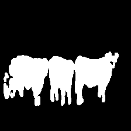
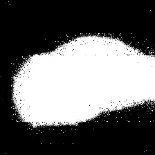
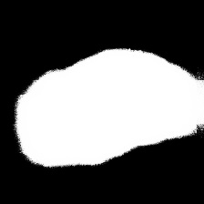
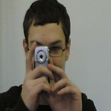
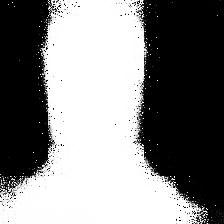

# Machine Learning Engineer Nanodegree
## Capstone Project -- Fully Convolutional Network for Image Segmentation
Charlio Xu
November 2nd, 2017

## I. Definition

### Project Overview

Computer vision is a popular and fascinating field for deep learning. Common tasks in computer vision include image classification, object detection, object localization and image segmentation. In this project, we are going to implement two fully convolutional networks for image segmentation. In image segmentation, our task is not only to detect and localize common objects which have been learned by some classification neural network, but also need to give a pixel-wise classification. So this task is more involved than object detection and localization in which a box is usually used to capture objects in the image. The following pair of images and the corresponding ground-truth segmentation shows clearly what segmentation is:

 

The technique we'll use in this project is **Fully Convolutional Network**, its application to image segmentation is described in the paper: [Fully Convolutional Networks for Semantic Segmentation](https://people.eecs.berkeley.edu/~jonlong/long_shelhamer_fcn.pdf)

### Problem Statement

The goal of this project is to implement the fully convolutional networks FCN32 and FCN16 fine tuned on VGG16 to give pixel-wise classification of images in order to extract detailed information about the localization and shape of common objects in the images. Tasks involved in the project are the following:

1. Download and preprocess PASCAL VOC2012 data
2. Design and implement FCN32 and FCN16 models in Keras
3. Train FCN32 and FCN16 with VOC segmentation data
4. Demonstrate the predictions from FCN32 and FCN16

### Metrics

[Dice coefficient](https://en.wikipedia.org/wiki/S%C3%B8rensen%E2%80%93Dice_coefficient) is the common choice in object recognition and localization tasks. Though it is not used in the segmentation in the above paper, we are going to use it for our project because later I'll transform segmentation images into binary masks which only contain values of 0 and 1, so they can be analyzed by the Dice coefficient easily.

Dice coefficient is used to measure similarity of two mask images whose value at each pixel is either 0 or 1. It is defined as follows in our project: 

    def dice_coef(y_true, y_pred):
        y_true_f = K.flatten(y_true)
        y_pred_f = K.flatten(y_pred)
        intersection = K.sum(y_true_f * y_pred_f)
        return (2. * intersection + 1.0) / (K.sum(y_true_f) + K.sum(y_pred_f) + 1.0)

We will use it as our evaluation metric instead of accurary which is not suitable for our model because a mask image usually contains far more black background pixels of value 0.

We will also use the corresponding loss function which is simply the negative of Dice coefficient:
    
    def dice_coef_loss(y_true, y_pred):
        return -dice_coef(y_true, y_pred)

## II. Analysis

### Data Exploration

I am going to use the [PASCAL VOC2012](http://host.robots.ox.ac.uk/pascal/VOC/voc2012/) dataset in this project. Notice that this dataset is also used for image classification which is not our purpose. We will only need to use a subset of it. The detailed specification can be found in the [Segmentation Image Sets](http://host.robots.ox.ac.uk/pascal/VOC/voc2012/htmldoc/devkit_doc.html#tbl:segstats). In summary, there are 2913 pairs of image and segmention in our training and validation dataset. Each image contains some common objects for us to detect. These objects have been learned previously in other classification models. Each image or segmentation has size (500, 332, 3).

### Exploratory Visualization

Below is another example pair of image and the corresponding segmentation:

 

### Algorithms and Techniques

#### Convolutional Neural Network
A convolutional neural network contains several convolutional layers which uses a number of small filters to apply convolution with the input images or intermediate features locally in order to learn 2D-topology-sensitive local patterns. Deep cnn can contain many convolutional layers. For example, the [VGG16](https://gist.github.com/baraldilorenzo/07d7802847aaad0a35d3) classification model has 13 convolutional layers and 3 fully connected layers. Each convolutional layers use 64-512 filters of size (3, 3). Finally, after a softmax, the model will produce a class label for the input image.  

#### Fully Convolutional Neural Network
A cnn classification model is only able to produce a label for the input image. If we want to preduce a pixel-wise classification, which means we'll label every pixel in the image to determine whether the pixel belongs to a human, a cat, a car or a house, etc... Then how can we accomplish this kind of task? The answer is given in this paper [Fully Convolutional Networks for Semantic Segmentation](https://people.eecs.berkeley.edu/~jonlong/long_shelhamer_fcn.pdf). Recall in the VGG16 model, there are three dense layers after the 13 convolutional layers. Now we replace these dense layers with conolutional layers instead, so that at these intermediate steps, we still preserve the 2D structure of the image and not flatten it. In this way, we will get information both about the classes prediction and the localization. Moreover, recall that we use pooling layers in cnn models to reduce the image size. For segmentation, the desired output of a model shall have size (width, height, classes). Then how can we go from smaller reduced images to the original size?

#### Deconvolutional Layers
The answer is to use deconvolutional layers. Deconvolutional layer is also called convolution transpose. In Keras, it is named [Conv2DTranspose](https://keras.io/layers/convolutional/#conv2dtranspose). After a deconvolutional operation, we often need a [cropping](https://keras.io/layers/convolutional/#cropping2d) to further adjust the image size.

#### Skip Structure
The [FCN32](https://github.com/Charlio/image-classification-segmentation/blob/master/models/fcn32.py) model simply upsamples reduced images 32 time to the original size which is (224, 224). Since the model uses result from deep layers which contain more information about global structures of an image instead of local patterns, we will see that prediction from FCN32 is coarse. Though coarse, it still quite successfully captures the main parts of objects in the images. In order to detect smaller patterns like thin and long parts such as wings, legs, arms, antennas, only need to add weights from more shallow layers. This combination of shallow layers containing local patterns with deep layers containing global structures is called a skip structure. In this project, we will use a skip structure in the [FCN16](https://github.com/Charlio/image-classification-segmentation/blob/master/models/fcn16.py). One can go even further to implement the FCN8 model also mentioned in the paper, but we'll stop at FCN16 in this project, since FCN models are even more time-consuming to train than the already time-consuming CNN models.

#### Transfer Learning on Previous Simpler Models
FCN models are built upon CNN models. After all, in order to conduct image segmentation, one first should know very well about the object classes we are going to find. However, we'll skip the classification training in this project and instead to use weights from the 13 convoluational layers in VGG16 in our FCN32 model. Recall our FCN32 model differs from VGG16 only after the 13 convolutional layers. In addition, we'll use weights of all convolutional layers from FCN32 in training of FCN16. So if you are going to go through the training process in this project, remember to first download the VGG16 weights.

### Benchmark

Exact benchmark for our project does not exist, since I simplified the problem by using binary masks instead of colored segmentations. So instead of predicting among say 21 classes, we only need to predict between 2 classes: 0 for black background and 1 for white object mask. However, I still found something that might be helpful as benchmarks: [The Berkeley Segmentation Dataset and Benchmark](https://www2.eecs.berkeley.edu/Research/Projects/CS/vision/bsds/)

To have a sense about the final power of the full-ledged FCN series models, below is the evaluation results in the paper:

|              | pixel acc. | mean acc. | mean IU | f.w. IU |
|--------------|------------|-----------|---------|---------|
| FCN32s-fixed | 83.0       | 59.7      | 45.4    | 72.0    |
| FCN32s       | 89.1       | 73.3      | 59.4    | 81.4    |
| FCN16s       | 90.0       | 75.7      | 62.4    | 83.0    |
| FCN8s        | 90.3       | 75.9      | 62.7    | 83.2    |

## III. Methodology

### Data Preprocessing
Data preprocessing is done in the [data.py file](https://github.com/Charlio/image-classification-segmentation/blob/master/data.py)

For each original image, we resize it to (224, 224, 3) which is compatible with the VGG16 model. For segmentation purpose, we also normalize it by substracting the mean and divided by the standard deviation.

For each segmentation image, we transform it into a white/black mask. So finally our training data will be two numpy arrays of sizes (2913, 224, 224, 3) and (2913, 224, 224, 1). There are 2913 pairs of normalized image and corresponding mask. Pixels in the normalized image have mean 0 and std 1. Each pixel in the mask takes values either 0 or 1. Following shows a mask image in which pixels take values 0 or 255.

### Implementation

Training is done in the jupyter notebook [model-review-and-training.ipynb](https://github.com/Charlio/image-classification-segmentation/blob/master/model-review-and-training.ipynb).

1. Compile VGG16 and load its weights
2. Compile FCN32 with the specification:
    
        adam = optimizers.Adam(lr=1e-6, beta_1=0.9, beta_2=0.999, epsilon=1e-08, decay=0.0)
        fcn32.compile(loss=dice_coef_loss,
              optimizer=adam,
              metrics=[dice_coef])
3. transfer weights of VGG16 into FCN32 and start training with preprocessed data:
         
         fcn32.fit(imgs, masks, 
          batch_size=16, 
          epochs=15,
          verbose=1,
          validation_split=0.2)
 
    With the use of one gpu(GM204M [GeForce GTX 980M]), I trained for 15 epochs which took about one hour. 
    
4. I then saved the FCN32 weights, and show one example of its prediction.

5. Repeat the steps for training FCN16 with transfered weights from FCN32. Notice I only trained for 5 epochs, feel free to try longer to get more accurate results.

### Refinement

1. To make life much easier, we used weights from pre-trained VGG16 model. This gives our FCN models a very good start.
2. I used one gpu on my laptop. Use the following cod to call the first gpu:

        import os
        os.environ['CUDA_VISIBLE_DEVICES'] = '0'
3. After about 10 epochs for FCN32, loss decreases slower, so use a smaller learning rate from then on, say 1e-6 instead of previous 1e-5.
4. The final validation dice coefficient I got for FCN32 is 0.7761, while that for FCN16 is 0.7835. So one can see it becomes even harder to train the FCN16 model. The original authors trained these models for hours.
5. 

## IV. Results

### Model Evaluation and Validation

1. 20% of the data were used for validation during training. I used all the 2913 pairs of image and mask for training. There is no test dataset, because the number of images and masks is small compared to the huge amount of parameters in the models(~134M).
2. Performance is given by apply the model directly on images to produce masks, and we can visually compare the results as will show later.
3. Since I used binary masks, the Dice coefficient is used as the evaluation metric, while its negative is used as the loss function during training.
4. I tested several images for FCN32 and FCN16. For all images, FCN16 performed better than FCN32 which is expected. The models perform very well to find objects, and are able to give the general shape mask of objects. Models give more accurate masks for objects without many tiny, small, thin, or long parts. Models perform worse on detecting local patterns like the wings of airplanes, legs and arms, etc. The reason is that we didn't exploit the shallow layer information. Though we used one shallow layer in FCN16, it is still not enough. In order to detect local pattern, we should use shallower layer weights. This is done in the FCN8 model mention in the paper. 

### Justification

1. The FCN series models I trained are very successfully in finding common objects. They also work well in draw the overal shape of objects since we extract a lot of global information from the deeper layers.
2. Models fail to detect local patterns because local information from shallow layers are not used much. 
3. Since it is easy to write model definitions in Keras, one can continue to define the FCN8 model, or even FCN4 or FCN2 to get a better result.
4. Due to lack of time, I only trained FCN32 for one hour, and less than 30mins for FCN16. If trained longer, models shall perform better.
5. The segmentation dataset only contains 2913 pairs of image and masks. One can use augmentation to generate more data in order to train the models longer and effectively.

## V. Conclusion

### Free-Form Visualization

Let us look at two examples of predictions. Left image is the original image, middle one is the prediction from FCN32, right one is the prediction from FCN16.

  

  

### Reflection

1. The models are well-established in the paper and implemented by the authors. However, I found online resources about fully convolutional networks like blogs, git repos, papers not easy to read. This project shall be the easiset one to understand and implement while still works well up to this time.
2. It takes some time to understand all the differences FCN models make from the original VGG classification models. New concepts include deconvolution, dice coefficient, or cross entropy for logits which are used by other developers for the full-fledged FCN models.
3. These models have huge amount of weights about 130M. The h5 files are about 1.5GB compare to VGG16's 500MB. So in order to get good results, one has to feed models a lot of data. However, even the VOC dataset only has 2913 paired images. If one wants to use it for other more professional purposes, then it will be difficult to collect enough data for training. For example, look at this kaggle competition on [ultrasound nerve segmentation](https://www.kaggle.com/c/ultrasound-nerve-segmentation)
4. Recall we used weights of VGG16 to train our FCN models. In order to do image segmentation, one needs to first train a classification modle on the objects that one wants to detect and localize. The VGG16 model is trained on 1000 classes of common objects. If one wants to detect other uncommon objects, then one will have more work to do.

### Improvement

1. This project is a good starting point for one to learn more about image segmentation. I made it easy to understand and implement in Keras.
2. Start from here, one can continue to implement FCN8.
3. Then the next step will be to implement the full-fledged FCN series models, which is able to detect object classes. Original FCN models were trained for 20 object classes, while I simplified it to binary.
4. One runnable implementation in tensorflow is given [here](https://github.com/warmspringwinds/tf-image-segmentation)
5. Implementation in caffe from the original author is given [here](https://github.com/shelhamer/fcn.berkeleyvision.org)
